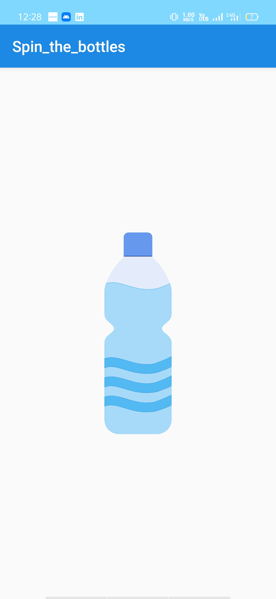

# Spin_the_bottle

## Getting Started

1.Fork this project into your github repo 
2.Clone project into local computer 
3.Use Android Studio or VS Code to debug or install this app on your mobile phone 
4.Enjoy

### Prerequisites
1.Android Studio or VS Code editor  
2.Android Phone  

## Screenshots

## Built With

* Android Studio
* Love

## Language implementation
* Java

## Want to contribution ?
* We welcome everyone to contribute on this project
### To contribute
* Fork this project
* Clone onto your local computer
* debug code or add features or anything you want to add
* Send the pull request

## Authors

Jaspreet Singh

